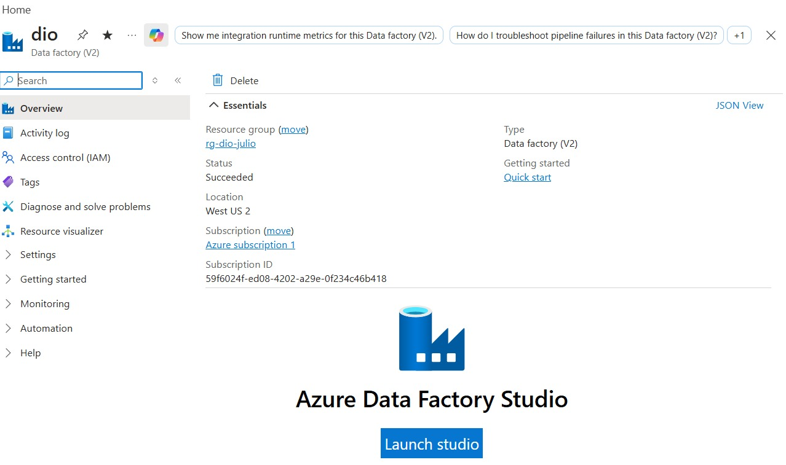

# Monitoramento de Custos no Azure Data Factory

## Sobre o projeto

Este projeto foi desenvolvido como parte de um desafio prático da DIO.

O objetivo foi criar um recurso do Azure Data Factory e compreender como organizar recursos, acompanhar implantações e monitorar o uso e os custos dentro do Microsoft Azure.

## Objetivos

- Criar um grupo de recursos no Azure.
- Criar um recurso Azure Data Factory.
- Utilizar uma convenção de nomes para os recursos.
- Verificar a implantação do recurso.
- Compreender a importância do monitoramento de custos.
- Documentar o processo no GitHub.

## Recursos utilizados

- Microsoft Azure
- Azure Data Factory
- Azure Resource Group
- Azure Portal
- GitHub
- Markdown

## Configuração realizada

| Item | Configuração |
|---|---|
| Assinatura | Azure subscription 1 |
| Grupo de recursos | rg-dio-julio |
| Recurso | dio |
| Tipo | Data Factory V2 |
| Região | West US 2 |
| Rede | Ponto de extremidade público |

## Processo de criação

1. Acesso ao Portal Azure.
2. Seleção da assinatura.
3. Criação ou seleção do grupo de recursos `rg-dio-julio`.
4. Configuração do Azure Data Factory.
5. Seleção da região `West US 2`.
6. Revisão das configurações.
7. Implantação do recurso.
8. Confirmação do status `OK`.

## Evidência da implantação

A implantação do Azure Data Factory foi concluída com sucesso e apresentou o status `OK`.

## Aprendizados

Durante o projeto, compreendi que os grupos de recursos ajudam a organizar recursos relacionados dentro do Azure.

Também aprendi que a tela de implantação permite verificar se o recurso foi criado corretamente e consultar detalhes como assinatura, grupo de recursos, tipo do serviço e status da operação.

Outro aprendizado importante foi a necessidade de acompanhar o uso dos recursos para evitar custos inesperados, principalmente quando se utiliza uma assinatura com créditos ou limites de consumo.

## Possibilidades de evolução

Como próximos passos, este projeto pode ser ampliado com:

- Criação de pipelines no Data Factory.
- Configuração de atividades de cópia de dados.
- Criação de conexões com diferentes fontes.
- Monitoramento de execuções.
- Configuração de alertas de custo.
- Utilização de templates ARM.
- Automação por meio do Azure Cloud Shell.
- Integração com serviços de armazenamento e bancos de dados.

## Conclusão

O projeto permitiu praticar a criação e a organização de recursos no Azure, além de reforçar a importância da documentação técnica e do controle de custos em ambientes de nuvem.
